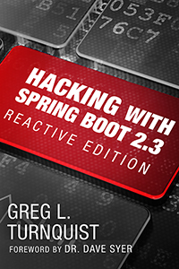

== Hacking with Spring Boot

*Spring Boot 2.3* is the hottest ticket in town...

...when it comes to Java development. Learn the latest features that can scale your apps including:

* Web and Data access
* Developer tools and test support
* Operational features
* Docker container baking
* Bottleneck discovery with BlockHound
* Messaging
* Security
* More!

Written cover-to-cover using Project Reactor, your apps will scale like never before.

https://www.amazon.com/Hacking-Spring-Boot-2-3-Reactive-ebook/dp/B086722L4L/[Grab your copy today] and learn to build top-notch, scalable solutions with modern tactics.

=== Code for the book

This is a standing repo of the code for Hacking with Spring Boot.

CAUTION: No have Java? I suggest you download and install sdk and use it to install your favorite version of Java 8!

Stay tuned. In the meantime, http://www.urbandictionary.com/define.php?term=share%20and%20enjoy[share and enjoy]!

== Licensing

The code in this project is licensed http://apache.org/licenses/LICENSE-2.0.txt[Apache License v2.0].

== Contributions

Please read the related link:CONTRIBUTING.adoc[CONTRIBUTING] document if you are interested in making contributions.